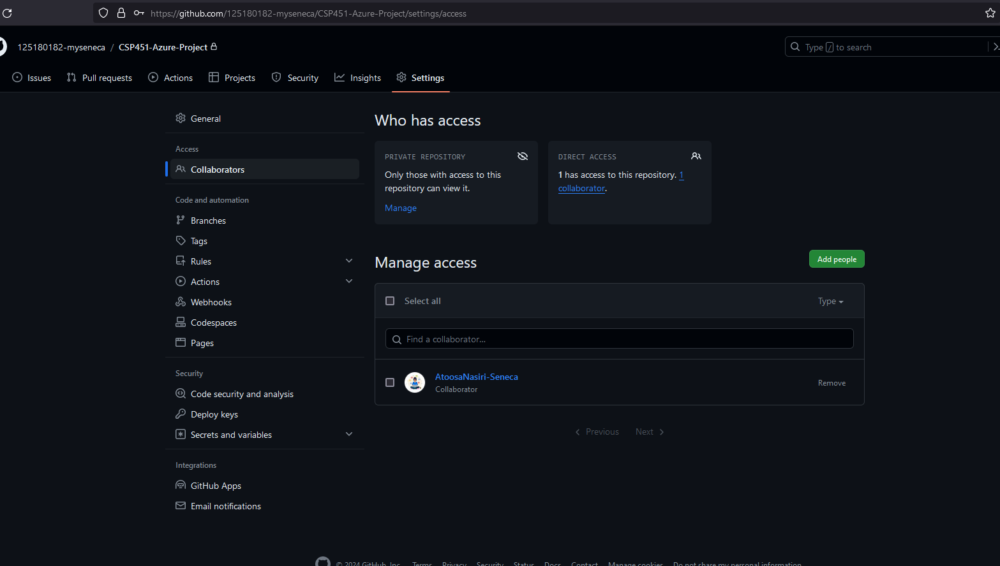

# CSP451-Azure-Project

### Checkpoint1 Submission

* ##### COURSE INFORMATION: CSP451
* ##### STUDENT’S NAME: Thuan Le
* ##### STUDENT'S NUMBER: 125180182
* ##### GITHUB USER_ID: 125180182-myseneca
* ##### TEACHER’S NAME: Atoosa Nasiri
___

### Table of Contents

1. [Image](#An-Image)
2. [Single line code snippet](#Single-line-code-snippet)
3. [Multi line code snippet](#Multi-line-code-snippet)
   
---
### An Image



---
### Single line code snippet
`print("This is a single-line code block!")`
### Multi line code snippet
```
#!/bin/bash
echo "Hello, this is a multi-line code block!"
echo "Provide a directory to list:"
read directory_path
ls $directory_path

```
---
### sample .json objects
```json
{
   "name":"Thuan"
   "age": 23
   "course":"CSP451"
   "school":"Seneca"
}
```
```json
{
   "Fruit":"Orange"
   "Vegetable":"Cabbage"
}
```
---
### Sample table
| This     | Is     | A           | Sample | Table  |
|----------|--------|-------------|--------|--------|
| With     | Random | Information | For    | My     |
| Course   | CSP451 | In          | The    | Winter |
| Semester |        |             |        |        |

---
### Sample hyperlink
<p> This is a sample <a href="https://github.com/125180182-myseneca/CSP451-Azure-Project">hyperlink</a> </p>


