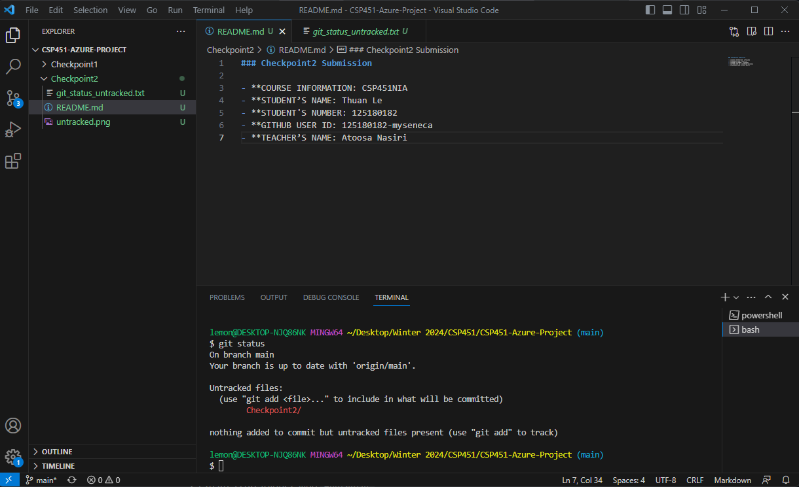
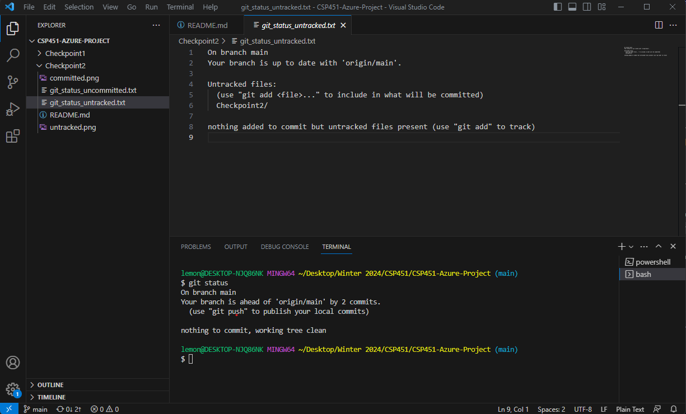
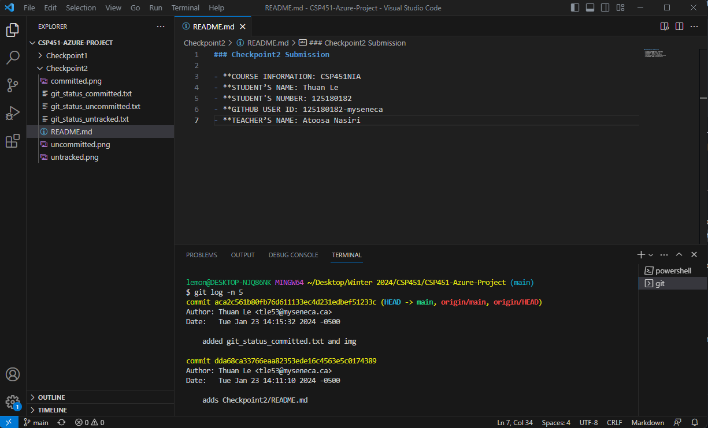
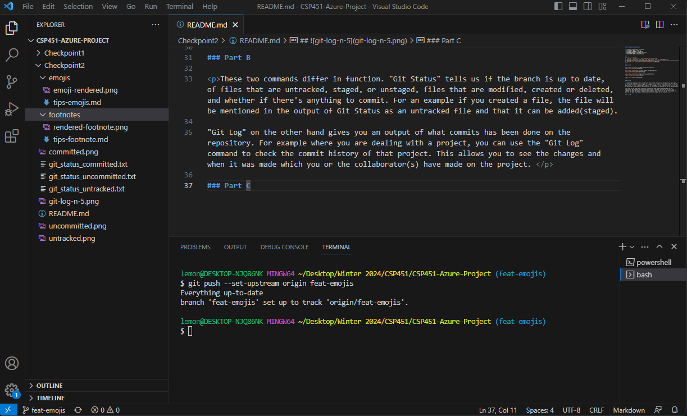
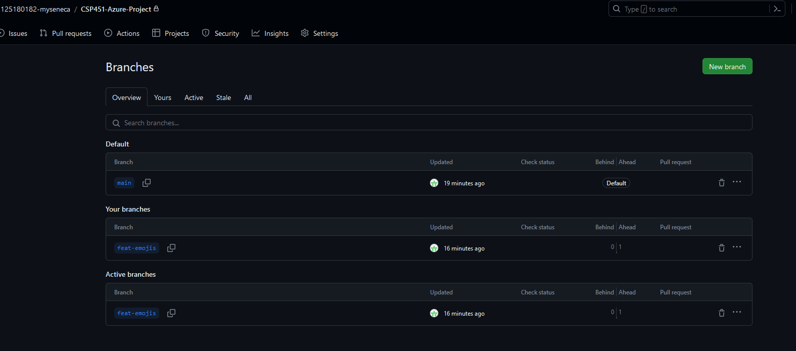
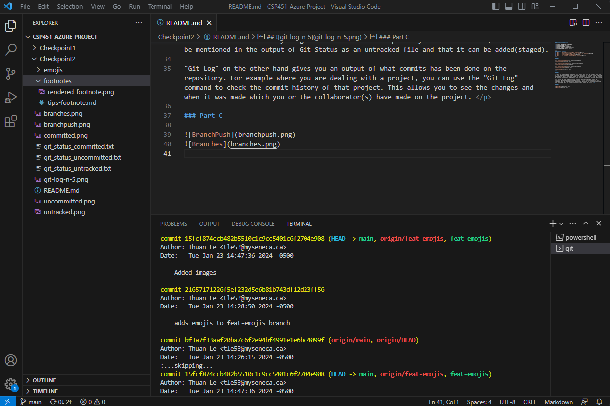

### Checkpoint2 Submission

- **COURSE INFORMATION: CSP451NIA
- **STUDENT’S NAME: Thuan Le
- **STUDENT'S NUMBER: 125180182
- **GITHUB USER ID: 125180182-myseneca
- **TEACHER’S NAME: Atoosa Nasiri

----
### Table of Contents
1. [Part A - Adding Files - Local Repo Workflow](#Part-A)
2. [Part B - Inspecting Local Repo with `git status` and `git log`](#Part-B)
3. [Part C - Creating & Merging Branches](#Part-C)
4. [Part D - Git Branching Strategy Review Question](#Part-D)
----

### Part A

[git_status_untracked.txt](git_status_untracked.txt)

[git_status_uncommitted.txt](git_status_uncommitted.txt)

[git_status_committed.txt](git_status_committed.txt)

----

### Part B

These two commands differ in function. "Git Status" tells us if the branch is up to date, of files that are untracked, staged, or unstaged, files that are modified, created or deleted, and whether if there's anything to commit. For an example if you created a file, the file will be mentioned in the output of Git Status as an untracked file and that it can be added(staged).

"Git Log" on the other hand gives you an output of what commits has been done on the repository. For example where you are dealing with a project, you can use the "Git Log" command to check the commit history of that project. This allows you to see the changes and when it was made which you or the collaborator(s) have made on the project. 

### Part C

[git_status_committed.txt](git_log_output.txt)

### Part D

1. What are the differences between develop branch and main branch?

    
 The difference between the develop branch and the main branch is that the main branch contains the source code which is intended to be deployed to production. The develop branch is meant for developers. Developers will branch off the develop branch to create updates and features which they then merge into the develop branch.

2. What are the three supporting branches? Briefly describe the function of each of these supporting branches.

    
 The three supporting branches are:

    ### Feature/Bugfix branches 
     1. The Feature/Bugfix branch is used by developers to create new features or to fix bugs. This branch branches off the develop branch. When using this branch, it is important to verify the commits to the develop branch as there are other collaborators. If there are commits to the develop branch, the changes of develop and the feature branch are required to merge, meaning the feature branch needs to be up to date with the develop branch before merging back with the develop branch.

    ### Hotfix branches
     2. The Hotfix branch is utilized for immediate improvement or changes to a production version which went wrong. It branches from the master branch so it doesn't affect the develop branch. This branch is necessary because at the time when a situation occurs and a hotfix is needed, the develop branch does not represent production as it may have commits from developers.

    ### Release Branches   
     3. The Release branch is used for preparation before release. It is used when the features and bug fixes that are planned for the release is completed and merged with the develop branch.
     
     
3. What are the best practices in working with release branches?

The best practices in working with release branches is that it should always be publicly available to other collaborators, must be branched from develop, restricted to only merge into master and develop, and it requires a naming convention that follows semantic versioning.

