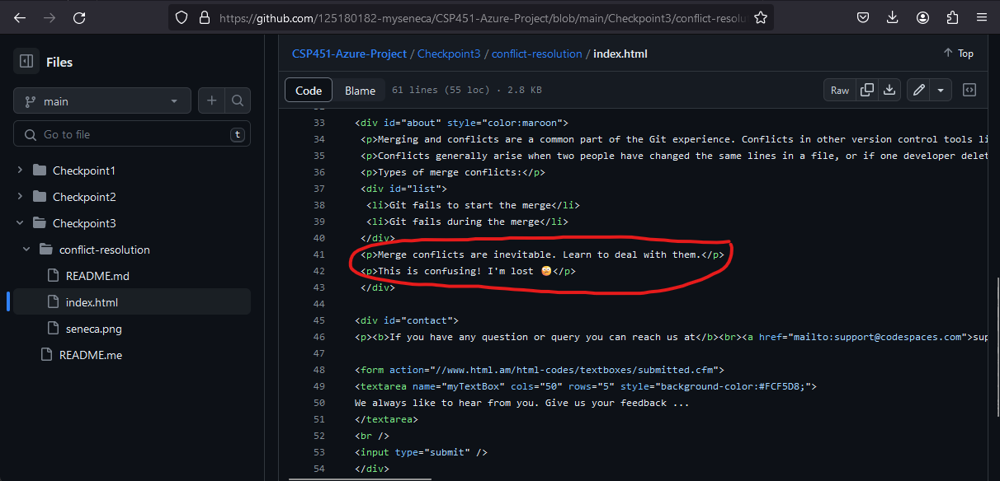
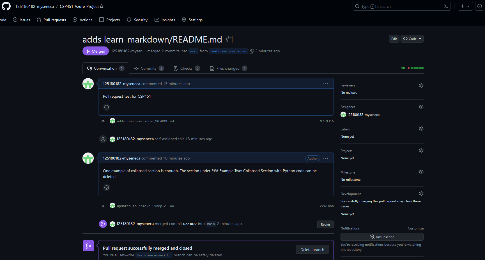

# Checkpoint3 Submission

- **COURSE INFORMATION: CSP451**
- **STUDENT’S NAME: Thuan Le**
- **STUDENT'S NUMBER: 125180182**
- **GITHUB USER ID: 125180182-myseneca**
- **TEACHER’S NAME: Atoosa Nasiri**

---

### Table of Contents
1. [Part A - Manage Conflicts - Overwrite Remote Changes](#part-a---manage-conflicts---overwrite-remote-changes)
2. [Part B - Manage Conflicts - Reset Local Commit Head](#part-b---manage-conflicts---reset-local-commit-head)
3. [Part C - Manage Conflicts - Merge Editor](#part-c---manage-conflicts---merge-editor)
4. [Part D - Collaboration - Creating Pull Request](#part-d---collaboration---creating-pull-request)

---

### **Part A - Manage Conflicts - Overwrite Remote Changes:**
*Follow the instructions and submit all files, and embed logs when asked in your READMe.md.* 
1. What is the color of the text after you forcefully overwrite remote with local changes?
    <p> The color of the text after forcefully overwriting remote with local changes is green. </p>

<details>

<summary>Part A: Logs</summary>


[part1-conflict-error.log](./logs/part1-conflict-error.log)

```
Pushing to https://github.com/125180182-myseneca/CSP451-Azure-Project.git
To https://github.com/125180182-myseneca/CSP451-Azure-Project.git
 ! [rejected]        main -> main (non-fast-forward)
error: failed to push some refs to 'https://github.com/125180182-myseneca/CSP451-Azure-Project.git'
hint: Updates were rejected because the tip of your current branch is behind
hint: its remote counterpart. If you want to integrate the remote changes,
hint: use 'git pull' before pushing again.
hint: See the 'Note about fast-forwards' in 'git push --help' for details.
```

[part1-conflict-overwrite.log](./logs/part1-conflict-overwrite.log)

```
POST git-receive-pack (710 bytes)
Pushing to https://github.com/125180182-myseneca/CSP451-Azure-Project.git
To https://github.com/125180182-myseneca/CSP451-Azure-Project.git
 + ed03126...de58f7d main -> main (forced update)
updating local tracking ref 'refs/remotes/origin/main'
```
</details>

---

### **Part B - Manage Conflicts - Reset Local Commit Head:** 
*Follow the instructions and submit all files, and embed logs when asked in your READMe.md.*
1. What is the color of the text after you forcefully overwrite remote with local changes?
    <p> The color of the text after resetting the local commit head is maroon.</p>

<details>
<summary>Part B: Logs</summary>

[part2-conflict-error.log](./logs/part2-conflict-error.log)
```
Pushing to https://github.com/125180182-myseneca/CSP451-Azure-Project.git
To https://github.com/125180182-myseneca/CSP451-Azure-Project.git
 ! [rejected]        main -> main (non-fast-forward)
error: failed to push some refs to 'https://github.com/125180182-myseneca/CSP451-Azure-Project.git'
hint: Updates were rejected because the tip of your current branch is behind
hint: its remote counterpart. If you want to integrate the remote changes,
hint: use 'git pull' before pushing again.
hint: See the 'Note about fast-forwards' in 'git push --help' for details.
```

[part2-pull-error.log](./logs/part2-pull-error.log)
```
POST git-upload-pack (196 bytes)
From https://github.com/125180182-myseneca/CSP451-Azure-Project
 = [up to date]      main        -> origin/main
 = [up to date]      feat-emojis -> origin/feat-emojis
Auto-merging Checkpoint3/conflict-resolution/index.html
CONFLICT (content): Merge conflict in Checkpoint3/conflict-resolution/index.html
Automatic merge failed; fix conflicts and then commit the result.
```

[part2-reset-head.log](./logs/part2-reset-head.log)
```
HEAD is now at de58f7d modifies style color in index.html to green
commit de58f7d5030e0b769c338fc3a442bb9cd5993a37
Author: Thuan Le <tle53@myseneca.ca>
Date:   Tue Jan 30 19:01:27 2024 -0500

    modifies style color in index.html to green
```

[part2-pull-success.log](./logs/part2-pull-success.log)
```
POST git-upload-pack (196 bytes)
From https://github.com/125180182-myseneca/CSP451-Azure-Project
 = [up to date]      main        -> origin/main
 = [up to date]      feat-emojis -> origin/feat-emojis
Updating de58f7d..08f2053
Fast-forward
 Checkpoint3/conflict-resolution/index.html | 2 +-
 1 file changed, 1 insertion(+), 1 deletion(-)
 ```
</details>

---

### **Part C - Manage Conflicts - Merge Editor:** 
*Follow the instructions and submit all files, and add screenshots asked in your READMe.md.*



---

### **Part D - Collaboration - Creating Pull Request:** 
*Follow the instructions and submit all files, and add screenshots asked in your READMe.md.*


