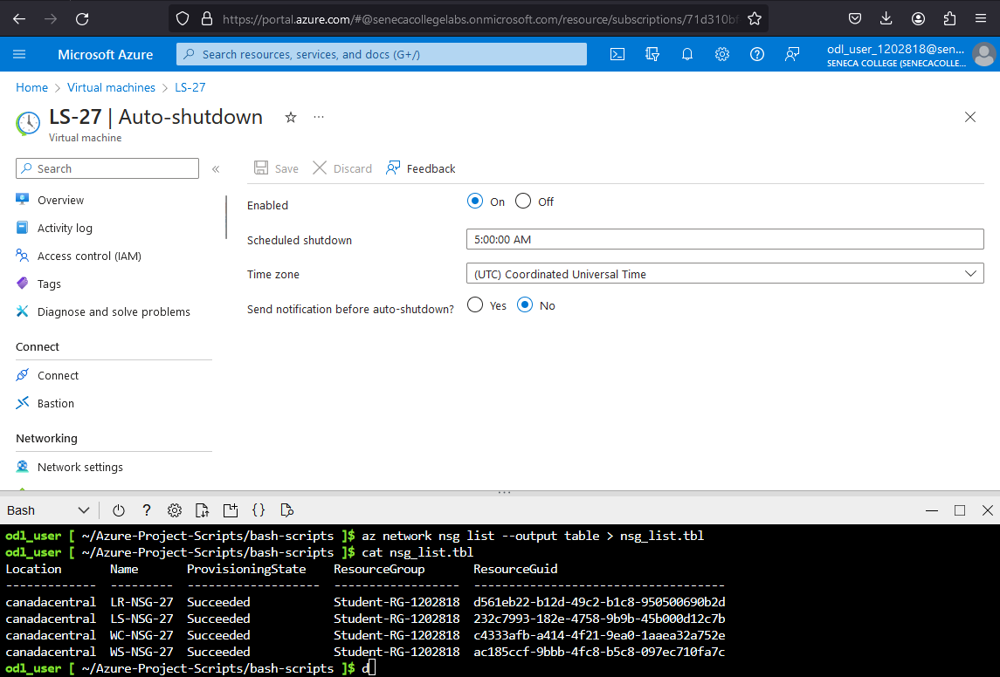

# Checkpoint4 Submission

- **COURSE INFORMATION: CSP451
- **STUDENT’S NAME: Thuan Le
- **STUDENT'S NUMBER: 125180182
- **GITHUB USER ID: 125180182-myseneca
- **TEACHER’S NAME: Atoosa Nasiri

---

1. [Part A - Creating Network Resources using Azure CLI](#part-a-creating-network-resources-using-azure-cli)
2. [Part B - Working with Azure CLI Bash](#part-b-working-with-azure-cli-bash)
3. [Part C - Network Review Questions](#part-c-network-review-questions)
4. [Part D - Creating Virtual Machines](#part-d-creating-virtual-machines-using-azure-cli)
5. [Part E - Creating Custom Images](#part-e-creating-custom-images-from-vms-using-azure-cli)
6. [Part F - Clean Up your Environment](#part-f-clean-up-your-environment-using-azure-cli)

---
### Part A: Creating Network Resources using Azure CLI
<details>
  <summary>Modified network_config.sh</summary>

```
RG_NAME="Student-RG-1202818"     # your student group
LOCATION="CanadaCentral"    # your location
ID="27"          #unique ID assigned to you

Student_vnet_name="Student-1202818-vnet"
Student_vnet_address="10.28.178.0/24"
Client_Subnet_name="Virtual-Desktop-Client"
Client_Subnet_address="10.28.178.0/24"
```
</details>

---
<details>
  <summary>Part A Questions:</summary>

1. **In network_config_test.sh what does if [[ ! $(az group list -o tsv --query "[?name=='$RG_NAME']") ]] do? Explain your answer.**
    
    ><p>To summarize, all this statement does is it checks whether if the Resource Group exists.</p>
    
    ><p>For the expression in the square brackets, it lists the resource groups, outputting to tsv output format, and then queries the output for resource groups that equal to the variable RG_NAME. The if statement only runs if there is no resource groups that are equal to the variable RG_NAME because of the ! symbol. </p>

2. **Why is it crucial to check if a resource exist before creating it? What bash syntax do you use to test this? How do you check if a vnet exists in vnet_create.sh?**

    ><p>It is crucial to check whether a resource exists before creating it. One of the reasons is because creating new resources can take a significant amount of time. For example, Azure Bastion takes about 10 minutes to deploy. The bash syntax you can use to test this is through a if statement with an expression. You can check whether if a vnet exists in vnet_create.sh by the following statement:</p> 
    
    `if [[ $(az network vnet list -g $RG_NAME -o tsv --query "[?name=='$vnet']") ]]`
    
3. **What is the Azure CLI command to create vnet? Give the specific command as per your environment and unique ID configuration. What are the required and what are the optional parameters that you need to pass to it?**

    ><p>The Azure CLI command to create a vnet is:</p>
    
    `"az network vnet create -n "VnetName". -g "resourceGroup"`. 
    
    ><p>The required parameters are vnet name and resource group. The optional parameters are address-prefixes and --subnet-name. In the context of my environment, my example CLI command would be:</p>
    
    `az network vnet create -n "Router-27" -g "Student-RG-1202818" --address-prefixes "172.17.27.0/24" --subnet-name "SN1" --subnet-prefixes "172.17.27.32/27"`

    
4. **What is the Azure CLI command to create subnet? Give the specific command as per your environment and unique ID configuration. What are the required and what are the optional parameters that you need to pass to it?**

    <p>The Azure CLI command to create a subnet is:</p>

    `az network vnet subnet create -n "name" -g "resourceGroup" --vnet-name "vnetName"`

    ><p>The required parameters are subnet name, resource group and vnet name. The optional parameters is address-prefixes. In the context of my environment, my example CLI command would be:</p> 
    
    `az network vnet subnet create -n "SN1" -g "Student-RG-1202818" --vnet-name "Router-27" --address-prefixes 172.17.27.32/27"`</p>
</details>

---

### Part B: Working with Azure CLI Bash

1. `az network vnet list --output json > vnet_list.json`

    [vnet_list.json](../Checkpoint4/files/vnet_list.json)

2. `az network vnet show -g Student-RG-1202818 -n Student-1202818-vnet --output json > student_vnet.json`

    [student_vnet.json](../Checkpoint4/files/student_vnet.json)

3. 
    `az network vnet peering list --resource-group "Student-RG-1202818" --vnet-name Router-27 --output table >> peerings.tbl`

    `az network vnet peering list --resource-group "Student-RG-1202818" --vnet-name Server-27 --output table >> peerings.tbl`

    `az network vnet peering list --resource-group "Student-RG-1202818" --vnet-name Student-1202818-vnet --output table >> peerings.tbl`

    [peerings.tbl](../Checkpoint4/files/peerings.tbl)
<details>
    <summary>peerings.tbl</summary>

    ```
        AllowForwardedTraffic    AllowGatewayTransit    AllowVirtualNetworkAccess    DoNotVerifyRemoteGateways    Name             PeeringState    PeeringSyncLevel    ProvisioningState    ResourceGroup       ResourceGuid                          UseRemoteGateways
    -----------------------  ---------------------  ---------------------------  ---------------------------  ---------------  --------------  ------------------  -------------------  ------------------  ------------------------------------  -------------------
    True                     False                  True                         False                        RoutertoServer   Connected       FullyInSync         Succeeded            Student-RG-1202818  e03e7ad0-bc31-01be-104e-8f735ce7e387  False
    True                     False                  True                         False                        RoutertoStudent  Connected       FullyInSync         Succeeded            Student-RG-1202818  a7b0fd61-9051-01ee-0749-f7da00aa9776  False
    AllowForwardedTraffic    AllowGatewayTransit    AllowVirtualNetworkAccess    DoNotVerifyRemoteGateways    Name            PeeringState    PeeringSyncLevel    ProvisioningState    ResourceGroup       ResourceGuid                          UseRemoteGateways
    -----------------------  ---------------------  ---------------------------  ---------------------------  --------------  --------------  ------------------  -------------------  ------------------  ------------------------------------  -------------------
    True                     False                  True                         False                        ServertoRouter  Connected       FullyInSync         Succeeded            Student-RG-1202818  e03e7ad0-bc31-01be-104e-8f735ce7e387  False
    AllowForwardedTraffic    AllowGatewayTransit    AllowVirtualNetworkAccess    DoNotVerifyRemoteGateways    Name                    PeeringState    PeeringSyncLevel    ProvisioningState    ResourceGroup       ResourceGuid                          UseRemoteGateways
    -----------------------  ---------------------  ---------------------------  ---------------------------  ----------------------  --------------  ------------------  -------------------  ------------------  ------------------------------------  -------------------
    True                     False                  True                         False                        Student-Bastion1202818  Connected       FullyInSync         Succeeded            Student-RG-1202818  46d3ed43-0a78-0f99-0570-67ec985d8700  False
    True                     False                  True                         False                        StudenttoRouter         Connected       FullyInSync         Succeeded            Student-RG-1202818  a7b0fd61-9051-01ee-0749-f7da00aa9776  False

    ```
</details>

4. Note: Router-27, SN1 does not contain any route associations, therefore I will use Server-27

#### Server-27 SN1 Details command:

`az network vnet subnet show -g Student-RG-1202818 -n SN1 --vnet-name Server-27`

<details>
    <summary>Server-27 SN1 Details Output</summary>

```
{
"addressPrefix": "172.17.27.32/27",
"delegations": [],
"etag": "W/\"c5ca55bf-3e33-4e57-b15f-d6011de8fbe3\"",
"id": "/subscriptions/71d310bf-1718-4d11-87d1-99a7d4e2053f/resourceGroups/Student-RG-1202818/providers/Microsoft.Network/virtualNetworks/Server-27/subnets/SN1",
"name": "SN1",
"privateEndpointNetworkPolicies": "Disabled",
"privateLinkServiceNetworkPolicies": "Enabled",
"provisioningState": "Succeeded",
"resourceGroup": "Student-RG-1202818",
"routeTable": {
    "id": "/subscriptions/71d310bf-1718-4d11-87d1-99a7d4e2053f/resourceGroups/Student-RG-1202818/providers/Microsoft.Network/routeTables/RT-27",
    "resourceGroup": "Student-RG-1202818"
},
"type": "Microsoft.Network/virtualNetworks/subnets"
}
```
</details>

#### Server-27 SN1 Routes command:

`az network vnet subnet show -g Student-RG-1202818 -n SN1 --vnet-name Server-27 --query routeTable`

<details>
    <summary>Server-27 SN1 Routes Output</summary>

```
{"id": "/subscriptions/71d310bf-1718-4d11-87d1-99a7d4e2053f/resourceGroups/Student-RG-1202818/providers/Microsoft.Network/routeTables/RT-27",
"resourceGroup": "Student-RG-1202818"
}
```
</details>

5. `az network route-table route list --resource-group Student-RG-1202818 --route-table RT-27 --output table > route_list.tbl`

    [route_list.tbl](../Checkpoint4/files/route_list.tbl)

<details>
    <summary>route_list.tbl</summary>
    
    ```
        AddressPrefix    HasBgpOverride    Name              NextHopIpAddress    NextHopType       ProvisioningState    ResourceGroup
    ---------------  ----------------  ----------------  ------------------  ----------------  -------------------  ------------------
    172.17.27.32/27  False             Route-to-Server   192.168.27.36       VirtualAppliance  Succeeded            Student-RG-1202818
    10.28.178.0/24   False             Route-to-Desktop  192.168.27.36       VirtualAppliance  Succeeded            Student-RG-1202818
    ```
</details>

6. `az network route-table route show --resource-group Student-RG-1202818 -n Route-to-Desktop --route-table-name RT-27 --output json >> route_details.json`

    `az network route-table route show --resource-group Student-RG-1202818 -n Route-to-Server --route-table-name RT-27 --output json >> route_details.json`

    [route_details.json](../Checkpoint4/files/route_details.json)

<details>
    <summary>route_details.json</summary>

    ```
    {
    "addressPrefix": "10.28.178.0/24",
    "etag": "W/\"10c8e919-dfbc-45dd-827e-aa844c280bbe\"",
    "hasBgpOverride": false,
    "id": "/subscriptions/71d310bf-1718-4d11-87d1-99a7d4e2053f/resourceGroups/Student-RG-1202818/providers/Microsoft.Network/routeTables/RT-27/routes/Route-to-Desktop",
    "name": "Route-to-Desktop",
    "nextHopIpAddress": "192.168.27.36",
    "nextHopType": "VirtualAppliance",
    "provisioningState": "Succeeded",
    "resourceGroup": "Student-RG-1202818",
    "type": "Microsoft.Network/routeTables/routes"
    }
    {
    "addressPrefix": "172.17.27.32/27",
    "etag": "W/\"10c8e919-dfbc-45dd-827e-aa844c280bbe\"",
    "hasBgpOverride": false,
    "id": "/subscriptions/71d310bf-1718-4d11-87d1-99a7d4e2053f/resourceGroups/Student-RG-1202818/providers/Microsoft.Network/routeTables/RT-27/routes/Route-to-Server",
    "name": "Route-to-Server",
    "nextHopIpAddress": "192.168.27.36",
    "nextHopType": "VirtualAppliance",
    "provisioningState": "Succeeded",
    "resourceGroup": "Student-RG-1202818",
    "type": "Microsoft.Network/routeTables/routes"
    }

    ```
</details>

7. `az network vnet subnet show -g Student-RG-1202818 -n SN1 --vnet-name Server-27`

---

### Part C: Network Review Questions

<details>
    <summary> Part C Questions: </summary>

1. **What is Azure Virtual Network (VNET)? Elaborate in your own words, you may use diagrams if drawn by yourself.**

    ><p>An Azure Virtual Network is similar to a network at home, but instead, the network environment is in the cloud. This allows the consumer to create Azure Resources within the particular network.</p>
    
2. **In the context of Hybrid Cloud architecture. How on-prem computers can access resources inside Azure virtual network?**

    ><p>There are many ways, but the easiest and less difficult method is to implement a virtual private gateway on the Azure virtual network.</p>
    
3. **What are the most important benefits of Azure Virtual Networks? Elaborate in your own words. Do not copy/paste from Azure Documentation. Itemized list of just benefit without proper elaboration will not receive any marks**

    ><p>One of the most important benefits of Azure Virtual Networks is that it gives you flexibilty on which availibility zone and regions you want to deploy your Network. Another great benefit is that you are able to deploy Azure Resources which can be accessed anywhere as long as you have internet. Lastly, you are also able to separate your Azure Resources in separate Azure Virtual Networks and still have them be able to communicate with each other.</p>
    
4. **What is the difference between Network Security Group (NSG) and Route-Tables?**

    ><p>The difference between a NSG and a Route-Table is that an NSG is used to filter traffic, while a Route-Table is used to add and control the routes between resources.</p>
    
5. **What is the difference between NSG and Firewalls?**

    ><p>NSG and Firewall are similar in the way of applying rules based filtering of traffic through IP addresses, Port Numbers, and Networks etc, but the difference between a NSG and Firewall is that NSG's are applied to interfaces or subnets of resources in a virtual network. While a Firewall is much more advanced and applied on a global level.</p>
    
6. **What is a hob-and-spoc network topology and how be deployed in Azure Cloud?**

    ><p>A hub and spoke network topology consists of a hub and as many spokes as necessary. In the cloud, the hub is a centralized virtual network which contains common resources that spokes all share. It also controls and inspects traffic between spokes and the internet. In order to deploy it in Azure Cloud, you would need Virtual Networks. One of the Virtual networks can be a Hub which is peered to all the other Virtual Networks(Spokes).</p>
    
7. **In working with Azure VNETs, do you need to to define gateways for Azure to route traffic between subnets?**

    ><p>You do not need to define gateways for Azure to route traffic between subnets. Azure creates routes for each subnet which allow them to communicate with each other. In addition to this, you can also always create a user defined route.</p>
    
8. **When do you need to configure and use Virtual Network Gateways?**
    
    ><p>You only need to configure and use Virtual Network Gateways when you wish to communicate with a virtual network from an on premises or client.</p>
</details>

---

### Part D: Creating Virtual Machines using Azure CLI

1. **List all VMs and send the output in table format to vm_list.tbl file. What command did you use?**

    ><p>The command used was:</p>
    `az vm list --output table > vm_list.tbl`
    
    [vm_list.tbl](../Checkpoint4/files/vm_list.tbl)

2. **Get the details of your WC-99 using az show command and send the output in json format to WC-99-details.json file. What command did you use?**

    ><p>The command used was:</p>
    `az vm show --name WC-27 -g Student-RG-1202818 --output json > WC-99-details.json`

    [WC-99-details.json](../Checkpoint4/files/WC-99-details.json)
<details>
    <summary>WC-99-details.json</summary>

    ```
    {
    "additionalCapabilities": null,
    "applicationProfile": null,
    "availabilitySet": null,
    "billingProfile": null,
    "capacityReservation": null,
    "diagnosticsProfile": null,
    "etag": null,
    "evictionPolicy": null,
    "extendedLocation": null,
    "extensionsTimeBudget": null,
    "hardwareProfile": {
        "vmSize": "Standard_B2s",
        "vmSizeProperties": null
    },
    "host": null,
    "hostGroup": null,
    "id": "/subscriptions/71d310bf-1718-4d11-87d1-99a7d4e2053f/resourceGroups/Student-RG-1202818/providers/Microsoft.Compute/virtualMachines/WC-27",
    "identity": null,
    "instanceView": null,
    "licenseType": null,
    "location": "canadacentral",
    "managedBy": null,
    "name": "WC-27",
    "networkProfile": {
        "networkApiVersion": null,
        "networkInterfaceConfigurations": null,
        "networkInterfaces": [
        {
            "deleteOption": null,
            "id": "/subscriptions/71d310bf-1718-4d11-87d1-99a7d4e2053f/resourceGroups/Student-RG-1202818/providers/Microsoft.Network/networkInterfaces/wc-27",
            "primary": true,
            "resourceGroup": "Student-RG-1202818"
        }
        ]
    },
    "osProfile": {
        "adminPassword": null,
        "adminUsername": "tle53",
        "allowExtensionOperations": true,
        "computerName": "WC-27",
        "customData": null,
        "linuxConfiguration": null,
        "requireGuestProvisionSignal": true,
        "secrets": [],
        "windowsConfiguration": {
        "additionalUnattendContent": null,
        "enableAutomaticUpdates": true,
        "enableVmAgentPlatformUpdates": false,
        "patchSettings": {
            "assessmentMode": "ImageDefault",
            "automaticByPlatformSettings": null,
            "enableHotpatching": null,
            "patchMode": "AutomaticByOS"
        },
        "provisionVmAgent": true,
        "timeZone": null,
        "winRm": null
        }
    },
    "plan": null,
    "platformFaultDomain": null,
    "priority": null,
    "provisioningState": "Succeeded",
    "proximityPlacementGroup": null,
    "resourceGroup": "Student-RG-1202818",
    "resources": null,
    "scheduledEventsProfile": null,
    "securityProfile": {
        "encryptionAtHost": null,
        "encryptionIdentity": null,
        "proxyAgentSettings": null,
        "securityType": "TrustedLaunch",
        "uefiSettings": {
        "secureBootEnabled": true,
        "vTpmEnabled": true
        }
    },
    "storageProfile": {
        "dataDisks": [],
        "diskControllerType": "SCSI",
        "imageReference": {
        "communityGalleryImageId": null,
        "exactVersion": "19044.3086.230621",
        "id": null,
        "offer": "Windows-10",
        "publisher": "MicrosoftWindowsDesktop",
        "sharedGalleryImageId": null,
        "sku": "win10-21h2-pro-g2",
        "version": "latest"
        },
        "osDisk": {
        "caching": "ReadWrite",
        "createOption": "FromImage",
        "deleteOption": "Detach",
        "diffDiskSettings": null,
        "diskSizeGb": 127,
        "encryptionSettings": null,
        "image": null,
        "managedDisk": {
            "diskEncryptionSet": null,
            "id": "/subscriptions/71d310bf-1718-4d11-87d1-99a7d4e2053f/resourceGroups/Student-RG-1202818/providers/Microsoft.Compute/disks/WC-27_disk1_6ed372e1b3a841c89ad561e3904ec37c",
            "resourceGroup": "Student-RG-1202818",
            "securityProfile": null,
            "storageAccountType": "StandardSSD_LRS"
        },
        "name": "WC-27_disk1_6ed372e1b3a841c89ad561e3904ec37c",
        "osType": "Windows",
        "vhd": null,
        "writeAcceleratorEnabled": null
        }
    },
    "tags": {
        "DeploymentId": "1202818",
        "LaunchId": "38011",
        "LaunchType": "ON_DEMAND_LAB",
        "TemplateId": "7633",
        "TenantId": "353"
    },
    "timeCreated": "2024-02-07T08:00:37.407790+00:00",
    "type": "Microsoft.Compute/virtualMachines",
    "userData": null,
    "virtualMachineScaleSet": null,
    "vmId": "bd1f52fe-548d-4589-9054-f697c267fe1e",
    "zones": null
    }


    ```
</details>
    
3. **List all NSG using az list command and send the output in table format to nsg_list.tblfile. What command did you use?**
    
    ><p>The command used was:</p>
    `az network nsg list --output table > nsg_list.tbl`

    [nsg_list.tbl](../Checkpoint4/files/nsg_list.tbl)

```
    Location       Name       ProvisioningState    ResourceGroup       ResourceGuid
-------------  ---------  -------------------  ------------------  ------------------------------------
canadacentral  LR-NSG-27  Succeeded            Student-RG-1202818  d561eb22-b12d-49c2-b1c8-950500690b2d
canadacentral  LS-NSG-27  Succeeded            Student-RG-1202818  232c7993-182e-4758-9b9b-45b000d12c7b
canadacentral  WC-NSG-27  Succeeded            Student-RG-1202818  c4333afb-a414-4f21-9ea0-1aaea32a752e
canadacentral  WS-NSG-27  Succeeded            Student-RG-1202818  ac185ccf-9bbb-4fc8-b5c8-097ec710fa7c
```

4. **Provide screenshot of auto shutdown configuration for LS_XX. Is there any command to show this? What is the time-zone? What should be the correct time settings considering the time zone differences?**

    ><p>I couldn't find any Azure CLI command to show the auto shutdown configuration of a VM. The time-zone is Coordinated Universal Time. The correct time settings should be 12:00 a.m EST.</p>

    

5. **Why auto shutdown configuration is not done in vm_create code? Why is it a separate scripts? Is it possible to configure auto shutdown at the same time you are creating the VM?**

    ><p>Auto shutdown configuration is not done in vm_create code and they are separate scripts because it is not possible to configure auto shutdown at the same time you are creating the VM. The VM needs to be created before you can configure auto shutdown on the VMs.</p>

### Part E: Creating Custom Images from VMs using Azure CLI

1. **What are the difference between the script that creates VM from Azure Generic Image vs Custom Image? A good place to start is to compare the two scripts custom_vm_create.sh and custom_vm_create.sh and check the parameters passed to az vm create command. Elaborate the differences you observe.**

    ><p>The major difference between the two scripts is that the script for Azure Generic Image requires 2 separate functions for the Operating Systems, while the Custom Image script only requires 1 function.</p>

2. **If you run custom_vm_create.sh without custom image version number, the script will throw an error and show you the usage suggestion. What is the usage suggestion?**

    ><p>The usage suggestion is:</p>

    ```
    target_version parameter not provided
    Usage: ./image_create.sh <target_version>
    ```
    
3. **The script is purposefully written such that it waits on each custom image creation to be completed before proceeding to next image. Can you update the script such that custom images creation runs in background, i.e. how can you parallelize the process?Hint: only provide the single line command that you need to update**

><p>The only thing we need to do is add the & sign at the end of the command to parallelize the process.</p>

    `
    az image create --name $image_name \
                        --resource-group $RG_NAME \
                        --source $osDisk_id \
                        --data-disk-caching None \
                        --hyper-v-generation $hyperv_gen \
                        --location $LOCATION  \
                        --os-disk-caching None \
                        --os-type $os_type \
                        --storage-sku $OS_DISK_SKU & `
    
4. **Once all custom images are successfully created, run a command in CLI that lists all your Custom Images. Change the output format to table format and embed the answer in your submission.**
```
HyperVGeneration    Location       Name          ProvisioningState    ResourceGroup
------------------  -------------  ------------  -------------------  ------------------
V2                  canadacentral  lr-27-ver-27  Succeeded            Student-RG-1202818
V2                  canadacentral  ls-27-ver-27  Succeeded            Student-RG-1202818
V2                  canadacentral  wc-27-ver-27  Succeeded            Student-RG-1202818
V1                  canadacentral  ws-27-ver-27  Succeeded            Student-RG-1202818
```
    
6. **Get a list of your VM, NSG, NIC, Disks, and Custom Iamges using Azure CLI in table format. Which ones are empty? **Do not include screenshots, just embed the output in table format in your submission.**

#### VM's
```
Name    ResourceGroup       Location       Zones
------  ------------------  -------------  -------
LR-27   STUDENT-RG-1202818  canadacentral
LS-27   STUDENT-RG-1202818  canadacentral
WC-27   STUDENT-RG-1202818  canadacentral
WS-27   STUDENT-RG-1202818  canadacentral
```
#### NSG
```
Location       Name       ProvisioningState    ResourceGroup       ResourceGuid
-------------  ---------  -------------------  ------------------  ------------------------------------
canadacentral  LR-NSG-27  Succeeded            Student-RG-1202818  179d3d50-d4ce-4690-98db-9a9e64d3c20c
canadacentral  LS-NSG-27  Succeeded            Student-RG-1202818  d802eefa-ed47-4119-a783-7f5f81195a9a
canadacentral  WC-NSG-27  Succeeded            Student-RG-1202818  472459d9-c489-4e4e-8fb0-e21862479bf3
canadacentral  WS-NSG-27  Succeeded            Student-RG-1202818  70c77fdf-47b4-4dad-9103-df3670a583dd
```
#### NIC
```
AuxiliaryMode    AuxiliarySku    DisableTcpStateTracking    EnableAcceleratedNetworking    EnableIPForwarding    Location       MacAddress         Name    NicType    Primary    ProvisioningState    ResourceGroup       ResourceGuid                          VnetEncryptionSupported
---------------  --------------  -------------------------  -----------------------------  --------------------  -------------  -----------------  ------  ---------  ---------  -------------------  ------------------  ------------------------------------  -------------------------
None             None            False                      False                          True                  canadacentral  00-22-48-3C-E9-03  lr-27   Standard   True       Succeeded            Student-RG-1202818  a78e9860-ae73-4eee-8d20-94f79bca497e  False
None             None            False                      False                          False                 canadacentral  00-0D-3A-E8-A5-3E  ls-27   Standard   True       Succeeded            Student-RG-1202818  1127ea86-e75f-4472-9958-4f5a31df9dde  False
None             None            False                      False                          False                 canadacentral  00-0D-3A-E9-BF-A7  wc-27   Standard   True       Succeeded            Student-RG-1202818  8f970447-360e-4680-aa5a-335349794572  False
None             None            False                      False                          False                 canadacentral  00-22-48-B2-E6-A6  ws-27   Standard   True       Succeeded            Student-RG-1202818  13630cfc-edd1-45dc-ac61-3a887d509188  False
```
#### DISKS
```
Name                                             ResourceGroup       Location       Zones    Sku              OsType    SizeGb    ProvisioningState
-----------------------------------------------  ------------------  -------------  -------  ---------------  --------  --------  -------------------
LR-27_OsDisk_1_b06f5a7ce18d47aaa4730446bef52cec  STUDENT-RG-1202818  canadacentral           StandardSSD_LRS  Linux     64        Succeeded
LS-27_OsDisk_1_2f609e38d31e4b2a835f622eeaa2fc76  STUDENT-RG-1202818  canadacentral           StandardSSD_LRS  Linux     64        Succeeded
WC-27_OsDisk_1_0db9ab7a2f584a6fb964508ae8a37265  STUDENT-RG-1202818  canadacentral           StandardSSD_LRS  Windows   127       Succeeded
WS-27_OsDisk_1_9b439543f2ed4523acceb518f9483e6c  STUDENT-RG-1202818  canadacentral           StandardSSD_LRS  Windows   127       Succeeded
```

#### CUSTOM IMAGES
```
HyperVGeneration    Location       Name          ProvisioningState    ResourceGroup
------------------  -------------  ------------  -------------------  ------------------
V2                  canadacentral  lr-27-ver-27  Succeeded            Student-RG-1202818
V2                  canadacentral  ls-27-ver-27  Succeeded            Student-RG-1202818
V2                  canadacentral  wc-27-ver-27  Succeeded            Student-RG-1202818
V1                  canadacentral  ws-27-ver-27  Succeeded            Student-RG-1202818
```
---
### Part F: Clean Up your Environment using Azure CLI

1. **After deleting list all your VMs using az  vm list ... with the output in table format. What command did you use? How can you ensure all your VMs are deleted?**

    ><p>The command I used was: </p>
    `az vm list --output table`

    ><p>You can ensure all the VMs are deleted if it returns nothing in the output of the command. You can also check on the Azure Portal and search virtual machines.</p>

2. **Why you are not asked to delete Custom Images? What is the difference between VM and Custom Image that makes VM a very costly resource and Custom Images, negligible? (Hint: It is related to OS Disk)**

    ><p>We are not asked to delete Custom Images as we can use our Images to create our VM's for the next checkpoint. The difference between VM and Custom image is that the VM contains a provisioned OS disk, while a custom image is used to create new disks. This means that the VM requires more storage which means more cost. A custom image is also not active, meaning it doesn't turn on or off like a VM.</p>

3. **What are cost implications of NSG or NIC? Why are you deleting them?**
    
    ><p>NSG and NIC can cost money. I am deleting it just in case as I do not want to go over budget. I've searched whether they cost money, but found nothing.</p>

4. **Why you are not deleting Network backend like VNET and Route-Tables?**
    
    ><p>We are not deleting the Network backend like VNET and Route-Tables because they form the backbone structure of the our network. It allows the resourses we created to communicate. In addition, VNET's and Route-Tables are free of charge in Azure.</p>


